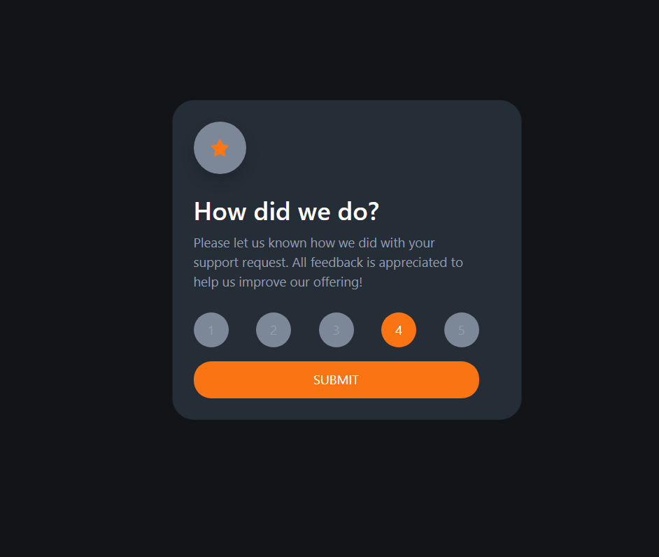

# interactive-rating-component

This is a solution to the [Interactive rating component challenge on Frontend Mentor](https://www.frontendmentor.io/challenges/interactive-rating-component-koxpeBUmI). Build with html and css js and bootstrap libarary. 

## Table of contents

- [Overview](#overview)
  - [Screenshot](#screenshot)
  - [The challenge](#the-challenge)
  - [Links](#links)
- [My process](#my-process)
  - [Built with](#built-with)
  - [What I learned](#what-i-learned)
- [Author](#author)
- [Acknowledgments](#acknowledgments)


## Overview

### Screenshot




### The challenge

Users should be able to:

- View the optimal layout for the app depending on their device's screen size
- See hover states for all interactive elements on the page
- Select and submit a number rating
- See the "Thank you" card state after submitting a rating


### Links

- Live Site URL: [https://ahmed-abo-rafat.github.io/interactive-rating-component/)

## My process

### Built with

- Semantic HTML5 markup
- CSS custom properties
- Flexbox
- CSS Grid
- Javascript
- Mobile-first workflow
- [Bootstrap](https://getbootstrap.com/) - HTML and CSS library


### What I learned

L learned from this challenge how i use symantic html and css, javascript and bootstrap to build responsive project and use javascript to add events to buttons.


Some of code snippets, see below:

```html
  <div class="d-flex justify-content-center align-items-center w-100 vh-100 p-3">
      <div class="card text-center p-5">
          
          <span class="my-4">You seleced 4 out of 5</span>
          <h2>Thnak you!</h2>
          <p>We appreciate taking the time to give a rating. if you ever need more support, dont hesitate to get touch!</p>
      </div>
  </div>

```
```css
:root {
  --White: hsl(0, 0%, 100%);
  --Light-Grey: hsl(217, 12%, 63%);
  --Medium-Grey: hsl(216, 12%, 54%);
  --Dark-Blue: hsl(213, 19%, 18%);
  --Very-Dark-Blue: hsl(216, 12%, 8%);
  --Orange: hsl(25, 97%, 53%);
}

```
```js
const listItems = document.querySelectorAll(".item");
listItems.forEach((item) => {
    item.addEventListener(('click'), function() {
        listItems.forEach((e) => {
            e.classList.remove('active');
        });
        this.classList.add('active');
    })
})

```


## Author

- Website - [Ahmed Rafat]( https://ahmed-abo-rafat.github.io/Portfolio/)
- Linked In - [Ahmed Rafat](https://www.linkedin.com/in/ahmed-rafat-a489301a2/)
- Twitter - [Ahmed Rafat](https://twitter.com/AR57355660)


